# ION BASTION

Tower defense in the browser, built with TypeScript, Phaser 3 and Vite. <!-- counts:start -->73 missions in 15 sectors<!-- counts:end --> with their own maps, waves and terrain styles, over thirty towers and <!-- counts:start -->62 enemy types<!-- counts:end --> on the ground and in the air. Play solo or with 2–4 players in co-op or versus mode.

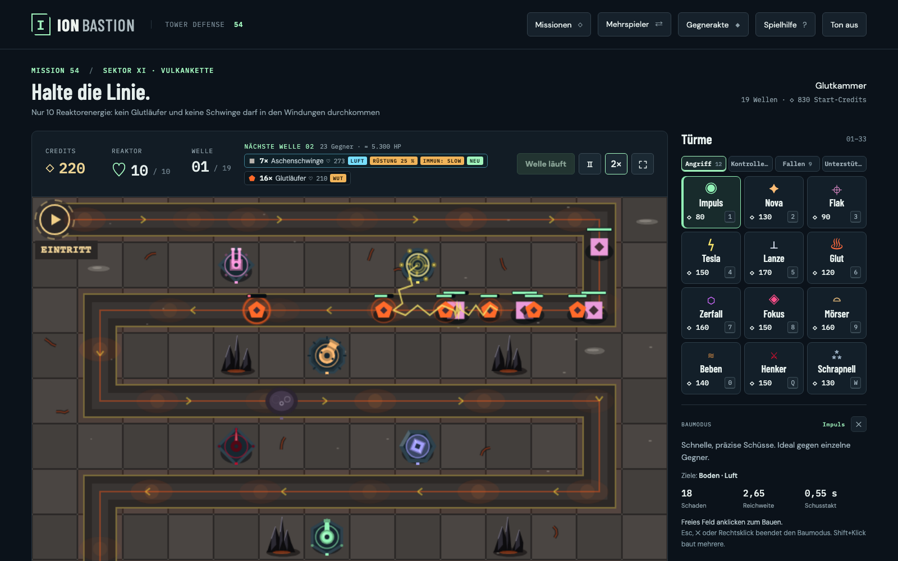

The game runs entirely in the browser; only multiplayer needs a small relay server. Saves live in memory on purpose: reloading restarts the current mission (it is in the address, `?mission=<id>`), and `/` leads to the start screen. The browser only remembers the last mission you started, which the start screen offers under "Continue".

## Quick start

Requirement: Node.js 22 or newer.

```sh
npm ci
npm run dev      # game on http://localhost:4173
npm test         # tests
npm run build    # production build to dist/
```

Notes for developers and AI agents (architecture, conventions, adding content) are in [CLAUDE.md](CLAUDE.md).

## How it works

Enemies walk a fixed path to the reactor. If one reaches the reactor, it costs reactor energy; at 0 the mission is lost. Between and during waves you build towers next to the path and upgrade them. You start the first wave yourself; after that the next wave starts by itself 10 seconds after the previous one ends (earlier with `N`, without a bonus). Defeated enemies pay credits, and every wave you survive pays a bonus. Selling refunds 70 % of the total investment.

## Screenshots

Every sector has its own terrain. In the Circuit (bottom right) there is no reactor: enemies circle until they are defeated.

<table>
  <tr>
    <td>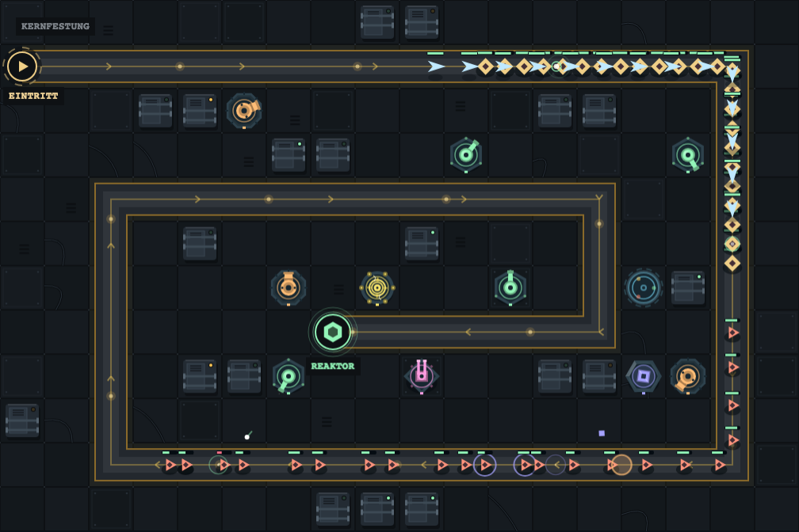<br><sub>Core Fortress · Border Zone</sub></td>
    <td>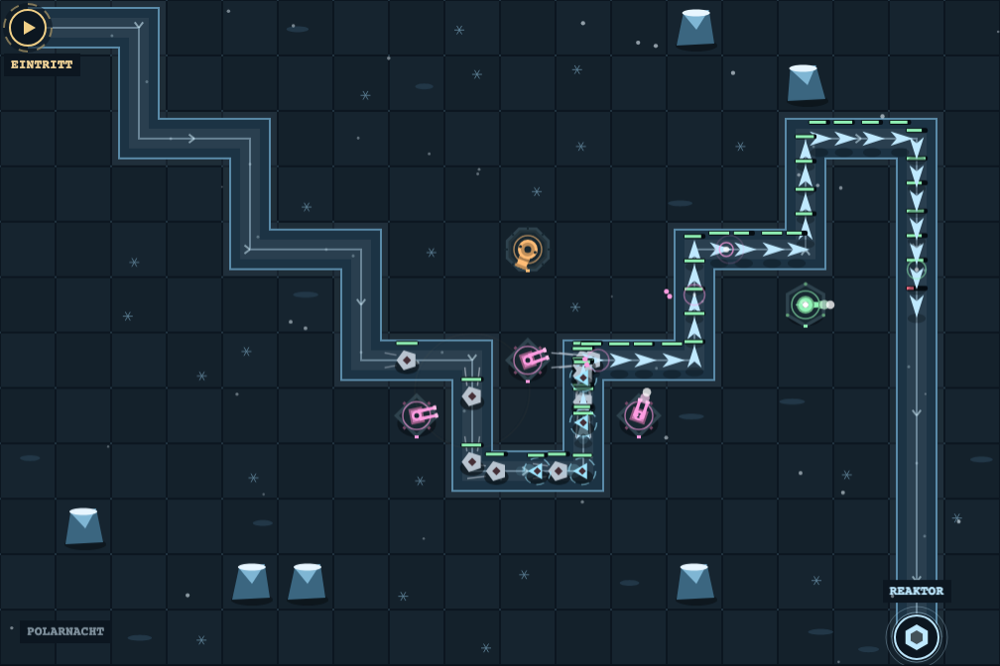<br><sub>Polar Night · Frost Belt</sub></td>
  </tr>
  <tr>
    <td>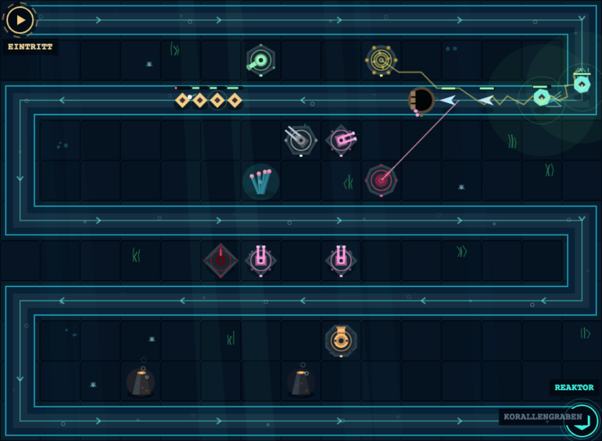<br><sub>Coral Trench · Deep Sea</sub></td>
    <td>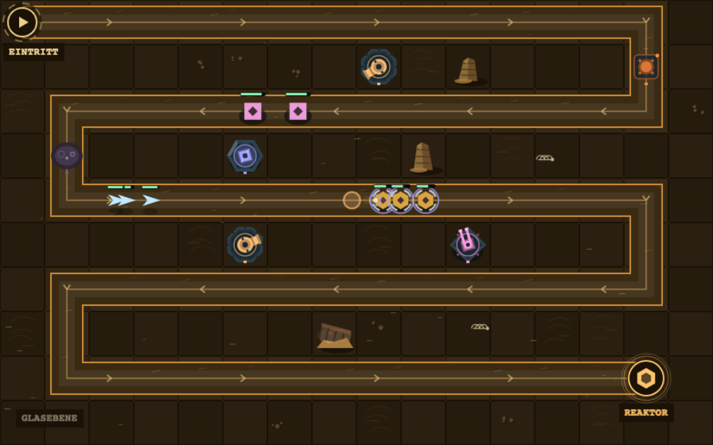<br><sub>Glass Plain · Dune Sea</sub></td>
  </tr>
  <tr>
    <td>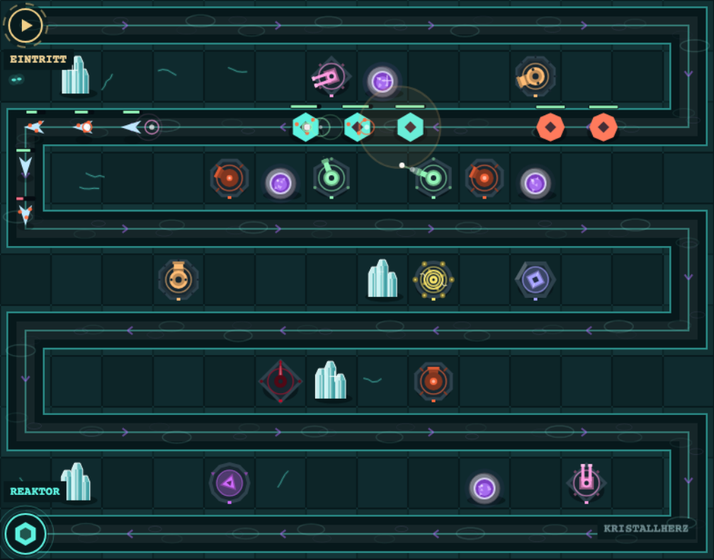<br><sub>Crystal Heart · Crystal Cave</sub></td>
    <td>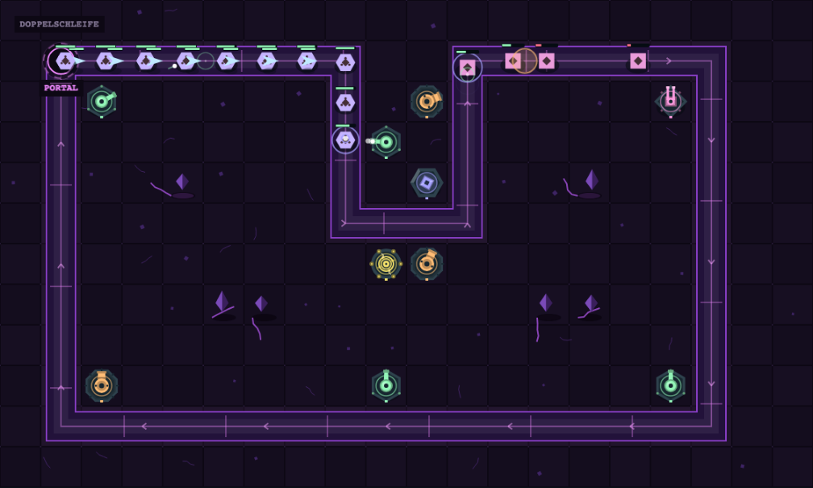<br><sub>Double Loop · Circuit</sub></td>
  </tr>
</table>

## Controls

`http://localhost:4173/?mission=<id>` opens a mission directly, for example `?mission=korallengraben`.

| Input | Action |
| --- | --- |
| Pick a tower, click a free tile | Build. Build mode ends afterwards; Shift+click builds more towers of the same type. |
| Click a built tower | Upgrade, sell or choose the target priority |
| Click an enemy | Show hit points, shield, traits and active effects |
| `T` | Cycle the target priority of the selected tower |
| Tabs Attack · Control · Traps · Support, `Shift`+`1`–`4` | Switch the tower page (from ten available towers; arrow keys also work on the tabs) |
| `1`–`9`, `0`, `Q`, `W` | Pick a tower in the open tab; every tab starts at `1` again (the key is shown on the card). Without tabs the keys count across all towers. |
| Right click, `Esc` or ✕ | Cancel build mode and selection. Without a selection, `Esc` leaves fullscreen. |
| `N` | Start the next wave (in versus: "Ready"). From wave 2 on it also starts by itself 10 s after the previous one ends. |
| Space | Pause, only during a wave or the countdown and not in versus |
| `F` or ⛶ | Fullscreen |
| Arrow keys + Enter | Keyboard control on the focused battlefield |

Switching tabs pauses a solo game automatically. Audio is optional and off by default.

## Multiplayer (2–4 players)

Start in two terminals in the project folder:

```sh
npm run server   # relay on ws://0.0.0.0:4174 (PORT=… overrides the port)
npm run dev      # game on http://0.0.0.0:4173
```

**Host**

1. Open `http://localhost:4173`.
2. On the start screen choose "Multiplayer" → "Create room". Send the four-letter room code (e.g. `KJSK`) to the other players.
3. Optionally "Choose mission"; you then return to the lobby. Without a choice, the currently loaded mission starts.
4. Choose a mode and "Start mission" once enough players are in the room. Everyone then switches to the game.

**Players**

1. Open the game from the host's machine: `http://<host-IP>:4173`.
2. "Multiplayer" → enter the room code → "Join".
3. Wait until the host starts the mission. You see the mode when it starts.

**Modes**

| Mode | Players | Rules |
| --- | --- | --- |
| Co-op | 2–4 | Shared map and reactor energy, separate credits. Starting credits, kill bounties and wave bonuses are split; Refineries pay their owner. Together you earn exactly as much as a solo player. Towers belong to their builder (colored corner: blue, amber, green, magenta); only the builder can upgrade and sell them. |
| Race | 2–4 | Everyone defends their own copy of the mission with full starting credits. Waves start for everyone at the same time once everyone has pressed "Ready", after 30 s at the latest. There is no break. The last player to hold their reactor wins. If several survive all waves, reactor energy decides, then the number of kills. |
| Siege | 2–4 | Like Race. In addition, under "Send" you send enemies into the field of the next player who is still in the game. That costs four times the kill bounty. You can only send enemy types that have already appeared in a wave. Sent enemies pay the defender no bounty. |

Circuit missions run in multiplayer as co-op only: everyone defends the same ring, the enemy limit applies to all together, and anyone can call the next wave early.

In all modes the host decides mission, restart and speed. Dialogs and tab switches do not pause in multiplayer.

**Troubleshooting**

- **"No relay reachable …":** `npm run server` is not running, or a firewall blocks port 4174.
- **Relay on another machine or port:** `http://<IP>:4173/?server=ws://<relay-IP>:4174`. Without this, the game connects to port 4174 on the machine that serves the page.
- **"The room is full …":** A room has four seats. Nobody can join after the mission has started.
- **A player leaves the room:**
  - The game stops and the remaining players move up. If the host leaves, the next player becomes host and can relaunch.
  - "Leave room" continues the mission alone.
  - Reconnecting is not supported yet.

## Missions

The game opens on the start screen with Continue, Campaign, Circuit, Multiplayer, Enemy Codex and Help; each item is its own page with "← Back", and the browser's back button works too. Under "Campaign" and "Circuit" all missions can be picked directly, with one tab per sector. In the game, "Menu" returns to the start screen and pauses the running wave; "Continue" resumes it. After a win, "Next mission" moves on.

<!-- missions:start -->
| No. | Mission | Focus | Map | Waves | Credits | HP/Wave |
| --- | --- | --- | --- | --- | --- | --- |
| **I** | **Border Zone** | | | | | |
| 01 | Outpost 07 | Build at bends | 18 × 12 | 10 | 240 | 14 % |
| 02 | Lock Ring | Inner bends, let towers fire repeatedly | 18 × 12 | 10 | 280 | 45 % |
| 03 | Shard Field | Build islands, overlapping ranges | 18 × 12 | 12 | 320 | 60 % |
| 04 | Ember Pass | Slow fast enemies with Cryo | 18 × 12 | 12 | 340 | 45 % |
| 05 | Core Fortress | Spiral with three defense zones | 18 × 12 | 15 | 400 | 65 % |
| **II** | **Frost Belt** | | | | | |
| 06 | Icebreaker | Long straights for the Lance | 22 × 11 | 13 | 380 | 72 %¹ |
| 07 | Cryo Valley | Cryo slows, Ember keeps burning | 18 × 12 | 13 | 400 | 58 % |
| 08 | Crevasse | Tight zigzag for Tesla | 18 × 12 | 14 | 420 | 66 %¹ |
| 09 | Polar Night | Glider swarms, anti-air | 18 × 12 | 14 | 440 | 75 % |
| 10 | Frostwall | Finale: two Titans, Decay | 18 × 13 | 15 | 460 | 72 % |
| **III** | **Acid Moor** | | | | | |
| 11 | Seepage Pit | Corrosion strengthens all towers | 18 × 12 | 13 | 420 | 70 % |
| 12 | Fog Swamp | Stasis halts groups | 21 × 12 | 13 | 440 | 80 % |
| 13 | Brackish Water | Only Pulse, Cryo, Corrosion, Flak | 16 × 12 | 14 | 440 | 86 % |
| 14 | Digester Tower | Spiral around the reactor, Aura clusters | 17 × 13 | 14 | 480 | 86 % |
| 15 | Toxic Cauldron | Finale: Tank waves, Corrosion and Decay | 20 × 12 | 15 | 500 | 88 % |
| **IV** | **Orbital Deck** | | | | | |
| 16 | Docking Ring | Build Refineries early | 18 × 12 | 14 | 460 | 80 % |
| 17 | Cargo Lock | Scarce starting credits | 16 × 11 | 14 | 290 | 82 % |
| 18 | Zero-G | Mostly air attacks | 18 × 12 | 15 | 480 | 83 % |
| 19 | Solar Sail | Wide station, long route | 22 × 10 | 15 | 510 | 90 % |
| 20 | Command Bridge | Finale with the full enemy mix | 20 × 12 | 16 | 540 | 90 % |
| **V** | **Ruined City** | | | | | |
| 21 | Rubble Avenue | Few build spots between rubble | 18 × 12 | 15 | 480 | 80 % |
| 22 | Bunker Line | Only Pulse, Nova, Cryo, Flak | 18 × 11 | 15 | 500 | 92 % |
| 23 | Cathedral | Short path, 15 reactor energy | 18 × 12 | 15 | 520 | 88 % |
| 24 | Elevated Rail | Sprinter swarms on long straights | 22 × 11 | 16 | 540 | 92 % |
| 25 | Citadel | Finale: two Titans at once | 20 × 13 | 16 | 580 | 90 % |
| **VI** | **Singularity** | | | | | |
| 26 | Event Horizon | Only 10 reactor energy | 18 × 12 | 16 | 520 | 90 % |
| 27 | Rift | Very short path, compact map | 15 × 10 | 16 | 560 | 95 % |
| 28 | Time Loop | Single waves with HP spikes | 18 × 12 | 17 | 580 | 110 %¹ |
| 29 | Zero Point | No Aura or Refinery, hard Tanks | 18 × 12 | 18 | 590 | 105 % |
| 30 | Core of the Singularity | Finale: 20 waves, three Titans | 20 × 13 | 20 | 650 | 110 % |
| **VII** | **Dune Sea** | | | | | |
| 31 | Quicksand | Armored Scarabs, force instead of spray fire | 16 × 10 | 16 | 600 | 110 % |
| 32 | Caravan Road | Burrowers dive, traps catch them | 16 × 11 | 17 | 620 | 102 % |
| 33 | Glass Plain | Only traps, Nova, Cryo and Flak | 16 × 10 | 16 | 700 | 105 % |
| 34 | Storm Crest | Only 10 reactor energy | 18 × 11 | 18 | 650 | 108 % |
| 35 | Oasis Zero | Finale: echo waves, two Titans | 18 × 11 | 19 | 700 | 112 %¹ |
| **VIII** | **Deep Sea** | | | | | |
| 36 | Continental Shelf | Armor Crabs with burst, Executioner and Pitfall break them | 16 × 9 | 17 | 650 | 110 % |
| 37 | Coral Trench | Healing Jellyfish in the air, Flak | 15 × 11 | 18 | 670 | 110 % |
| 38 | Pressure Chamber | Tight spiral, 10 reactor energy, echo waves | 15 × 11 | 18 | 690 | 110 %¹ |
| 39 | Black Smoker | Phantoms, no Aura or Refinery | 11 × 14 | 18 | 700 | 110 % |
| 40 | Abyss | Finale: all Deep Sea enemies, three Titans | 20 × 13 | 20 | 750 | 110 %¹ |
| **IX** | **Storm Front** | | | | | |
| 41 | Heat Lightning | Gust Runners race in bursts, slows and traps | 16 × 9 | 17 | 680 | 120 %¹ |
| 42 | Hailfield | Stormbirds, only 10 reactor energy | 15 × 11 | 18 | 700 | 110 %¹ |
| 43 | Lightning Rod | No Lance, Focus or Gravitron | 15 × 11 | 18 | 710 | 110 % |
| 44 | Gust Corridor | Echo waves in narrow alleys | 11 × 14 | 18 | 730 | 120 %¹ |
| 45 | Eye of the Storm | Finale: three Titans | 20 × 13 | 20 | 780 | 120 %¹ |
| **X** | **Jungle** | | | | | |
| 46 | Vine Trail | Swarm Ants, area damage thins them out | 15 × 9 | 18 | 720 | 240 % |
| 47 | Temple Steps | Regenerating Colossi, echo waves | 13 × 9 | 19 | 750 | 100 %¹ |
| 48 | Mangrove Swamp | Only area and force towers | 11 × 10 | 18 | 770 | 80 % |
| 49 | Snake Pit | Only 10 reactor energy | 14 × 11 | 18 | 790 | 100 % |
| 50 | Heart of the Jungle | Finale: three Titans | 15 × 13 | 20 | 820 | 58 %¹ |
| **XI** | **Volcano Chain** | | | | | |
| 51 | Ashfield | Ember Runners race at low HP, Cryo and Executioner | 11 × 7 | 18 | 760 | 100 %¹ |
| 52 | Lava Flow | Ash Wings in the air, echo waves | 14 × 9 | 18 | 780 | 100 %¹ |
| 53 | Slag Ridge | No Cryo, Stasis, Tar Pit or Bear Trap | 14 × 9 | 19 | 800 | 110 %¹ |
| 54 | Ember Chamber | Only 10 reactor energy | 14 × 11 | 19 | 830 | 110 %¹ |
| 55 | Volcano Throat | Finale: three Titans | 15 × 13 | 20 | 860 | 120 %¹ |
| **XII** | **Crystal Cave** | | | | | |
| 56 | Quartz Gallery | Crystal Wardens harden in rhythm, Ember burns through | 14 × 8 | 18 | 800 | 120 % |
| 57 | Hall of Mirrors | Shard Moths split into Gliders, echo waves | 13 × 10 | 20 | 820 | 120 %¹ |
| 58 | Geode Chamber | Only 10 reactor energy | 12 × 9 | 18 | 840 | 100 % |
| 59 | Prism Shaft | Phantoms, no Aura or Refinery | 10 × 10 | 18 | 860 | 100 % |
| 60 | Crystal Heart | Finale: three Titans | 14 × 11 | 20 | 880 | 110 %¹ |
| **XIII** | **Circuit** | | | | | |
| 61 | Orbit | Simple ring, max. 30 enemies, a wave every 22 s | 18 × 12 | 8 | 400 | 35 % |
| 62 | Double Loop | A dent merges two lanes, max. 30, every 20 s | 20 × 12 | 9 | 450 | 45 % |
| 63 | Maelstrom | Two dents, max. 35, every 18 s | 20 × 13 | 10 | 500 | 30 % |
| **XIV** | **Gearworks** | | | | | |
| 64 | Ring Gear | Cogwheels speed up the longer they circle, max. 36, every 20 s | 15 × 11 | 10 | 500 | 30 % |
| 65 | Escapement | Piston Tanks harden every lap, max. 32, every 18 s | 21 × 10 | 10 | 550 | 35 % |
| 66 | Balance Wheel | Echo in wave 8, the waist merges four lanes, max. 35, every 16 s | 15 × 11 | 11 | 550 | 40 %¹ |
| 67 | Planet Gear | Only core and control towers, max. 36, every 18 s | 15 × 15 | 11 | 600 | 40 % |
| 68 | Clockwork | Finale: two Titans, max. 34, every 16 s | 15 × 11 | 12 | 600 | 40 % |
| **XV** | **Moon Lake** | | | | | |
| 69 | Ebb | Spray Wings harden every lap, max. 45, every 18 s | 20 × 11 | 11 | 550 | 35 % |
| 70 | Tide Ring | Nautilus: shield and momentum, max. 42, every 17 s | 20 × 11 | 11 | 570 | 38 % |
| 71 | Surf | Long serpentine ring, max. 45, every 16 s | 22 × 12 | 12 | 600 | 40 % |
| 72 | Spring Tide | Short interval, tight limit, max. 35, every 14 s | 20 × 14 | 12 | 620 | 40 % |
| 73 | Lunar Eclipse | Echo wave, finale: three Titans, max. 40, every 16 s | 20 × 13 | 13 | 650 | 50 %¹ |

¹ Individual waves have their own HP factor instead of the linear growth.
<!-- missions:end -->

### Circuit

Circuit is its own game mode with its own tab in the mission picker, separate from the campaign. It has three sectors: Circuit, Gearworks and Moon Lake. Its missions play on closed rings without a reactor:

- You start the first wave yourself. After that a timer starts every further wave, even if the previous one is still running.
- Enemies circle until they fall. They deal no reactor damage.
- If more enemies are in the ring at once than the limit allows, the mission is lost. The "IN RING" display replaces reactor energy.
- With "Wave ▶" or `N` you call the next wave early. Every second saved pays credits; the button shows the bonus.
- Wave bonus and Refinery income arrive when the next wave starts.
- The mission is won when all waves have started and all enemies are defeated.

## Towers

Every enemy moves on the ground or in the air; every attack tower only hits certain layers.

| Tower | Cost | Attack | Targets |
| --- | --- | --- | --- |
|  Pulse | 80 | Single target | Ground · Air |
|  Nova | 130 | Area damage | Ground only (including the blast radius) |
| 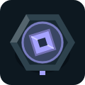 Cryo | 100 | Slow | Ground · Air |
|  Aura | 160 | Support, strengthens towers within radius 3 | – |
| 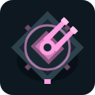 Flak | 90 | Single target, fast | Air only |
| 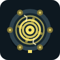 Tesla | 150 | Chain lightning: jumps up to 3× to enemies within 1.6 tiles, 75 % damage per jump | Ground · Air |
| 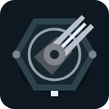 Lance | 170 | Pierce: beam up to range 4.4, hits every enemy on the line, 85 % per further hit | Ground · Air |
|  Ember | 120 | Burn: additionally 2.5 times the hit over 3 s | Ground · Air |
|  Stasis | 140 | Stun: pulse in radius 0.9 halts enemies for 0.8 s, then 1.5 s immune | Ground · Air |
|  Corrosion | 110 | Weaken: enemies in radius 0.8 take 25 % more damage for 3 s | Ground · Air |
| 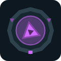 Decay | 160 | Anti-boss: hit plus 4 % of maximum HP | Ground · Air |
|  Focus | 150 | Charge: continuous beam holds its target, every follow-up hit +20 % damage, up to triple | Ground · Air |
|  Mortar | 160 | Artillery: range 5, blast radius 1.3, cannot fire at enemies closer than 1.5 tiles | Ground only |
| 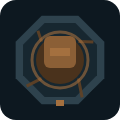 Quake | 140 | Close range: shockwave hits all enemies within range 1.8, still 50 % at the edge | Ground only |
|  Executioner | 150 | Execution: enemies below 25 % HP take four times the damage on impact | Ground · Air |
|  Shrapnel | 130 | Multi-target: every salvo hits up to 3 different enemies | Ground · Air |
|  Jammer | 130 | Disruption: pulse in radius 1.1 switches off shield, regeneration, healing, stealth, evasion and leader bonus for 3 s; shields break at once | Ground · Air |
|  Snare Net | 110 | Air trap: flyers 30 % slower for 3 s and targetable by ground towers like Nova | Air only |
|  Gravitron | 170 | Knockback: pulse in radius 1 pulls enemies back at 1.5 times speed for 0.6 s, then 2.5 s immune; Berserkers resist | Ground only |
|  Refinery | 120 | 25 credits after every wave, no attack | – |
|  Detector | 90 | Reveals stealthed enemies within radius 3.5, no attack of its own | – |
|  Bounty Beacon | 100 | Kills within radius 2.5 pay 50 % more credits (several Beacons do not stack), no attack | – |
|  Repair Dock | 150 | Restores 1 reactor energy after every wave, up to the starting value; not in the Circuit | – |
|  Tracker | 140 | Enemies within radius 2.2 take 15 % more damage, on top of Corrosion, no attack | – |

Nova, Mortar, Flak, Cryo, Executioner, Shrapnel and Snare Net fire projectiles that take time; fast enemies can dodge Nova shells. Tesla, Lance, Focus, Quake, Gravitron and Jammer hit instantly.

### Traps

You build traps directly on free path tiles (not on the entry or the reactor). They trigger as soon as a ground enemy walks onto their tile, even a stealthed one. Flyers pass over them. After triggering they reload; a light shows when they are armed again. Traps have the five levels of the attack towers, but their trigger radius stays the same.

| Trap | Cost | Effect | Level 4 / 5 |
| --- | --- | --- | --- |
|  Mine | 70 | Explosion with 80 damage in radius 1.1, 5 s reload | Radius 1.3 / 1.5 |
| 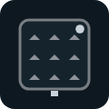 Caltrops | 60 | Bleed: for 4 s, 12 damage per further tile walked; held or pushed-back enemies do not bleed | 15 per tile / 18 per tile, 5 s |
|  Tar Pit | 60 | Enemies walk at 45 % speed for 1.5 s | 40 % for 2 s / 30 % for 2.5 s |
|  Bear Trap | 90 | Holds enemies for 1.5 s, then 2.5 s immune, 4 s reload | 1.8 s / 2.2 s, bigger grip |
| 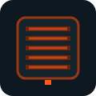 Flame Grate | 80 | Burn: three times the hit over 3 s | 3.5 times / 4 times over 4 s |
|  Spring | 100 | Throws enemies back along the path, then 3 s immune; Berserkers resist | further / even further |
|  Sticky Mine | 90 | Attaches a bomb to the enemy: 70 damage in radius 1.2 after 2 s, or at once when the carrier dies; chain reactions possible | Radius 1.4 / 1.6, fuse 1.5 s |
|  Pitfall | 120 | Swallows small enemies (Drone, Sprinter, Ice Strider, Phantom, Phase Runner, Packwolf, Jump Beetle, Rubble Swarm) at once, no matter how much HP; larger ones take 60 damage; 6 s to cover up | also Medic, Shield Bearer, Shard, Sludge, Prism Runner, Salamander, Martyr, Pioneer / also Tank, Null-Field Carrier |
|  Tripwire | 110 | On triggering, instantly reloads all attack towers within radius 2.5; 6 s to re-tension | Radius 3 / 3.5 |

**Attack towers** have five levels:

| Level | Cost (× build cost) | Damage | Range | Fire interval |
| --- | --- | --- | --- | --- |
| 2 | 0.9 | × 1.65 | + 0.3 | × 0.9 |
| 3 | 1.5 | × 2.72 | + 0.6 | × 0.81 |
| 4 | 3.0 | × 4.8 | + 0.8 | × 0.66 |
| 5 | 4.5 | × 7.0 | + 1.0 | × 0.6 |

Levels 4 and 5 are expensive, but bring more damage per credit than additional towers. Special towers also upgrade their effects:

| Tower | Level 4 | Level 5 |
| --- | --- | --- |
| Cryo | slows to 45 % speed, 2.3 s | 35 % speed, 2.8 s |
| Tesla | 4 jumps, 1.8 tiles | 5 jumps, 2 tiles |
| Lance | loses 10 % per pierce | 0 %, beam width 0.5 |
| Ember | burns for 3 times | 3.5 times, 3.5 s long |
| Stasis | 1 s, radius 1.1 | 1.2 s, radius 1.3 |
| Corrosion | +30 % damage | +40 %, radius 1 |
| Decay | 5 % of maximum HP | 6 % |
| Focus | +25 % per follow-up hit | +30 %, up to 12 stacks |
| Mortar | blast radius 1.5 | 1.7, dead zone 1.2 |
| Quake | 70 % at the edge | full force to the edge |
| Executioner | already below 30 % HP | 5 times damage below 35 % HP |
| Shrapnel | 4 targets per salvo | 5 targets |
| Jammer | 3.5 s, radius 1.3 | 4.5 s, radius 1.5 |
| Snare Net | 3.5 s | 40 % slower, 4.5 s |
| Gravitron | radius 1.2, 1.8 times pull | radius 1.4, 2.2 times, 0.7 s |

### Specializations (levels 6–8)

After level 5 every attack and control tower above offers three specializations. Buying the first tier commits that tower to the path; the other two are locked until you sell it. Each path has three tiers (levels 6, 7 and 8) costing 2.5, 4 and 6 times the build cost; a fully specialized Pulse costs 200 + 320 + 480 credits on top. Traps and support towers have no specializations. Tooltips show the final values of every tier.

| Tower | Path A | Path B | Path C |
| --- | --- | --- | --- |
| Pulse | Sharpshooter: +70 % against heavy targets | Overclock: 35 % less time between shots | Ricochet: every 2nd hit bounces for 65 % |
| Nova | Supernova: blast radius 2 | Siegebreaker: +60 % against armor | Chain Reaction: up to 3 kills explode again |
| Flak | Skyhunter: +70 % against heavy flyers | Flak Curtain: 3 extra flyers for 45 % | Wingclip: hit flyers 30 % slower |
| Tesla | Storm Network: 8 jumps, 2.6 cells | Overload: +85 % on a lone enemy | Twin Arc: every 2nd salvo a second chain |
| Lance | Longshot: +2.3 cells range | Broadbeam: half-width 0.95 | Rail Penetrator: ignores 60 % of armor |
| Ember | Incinerator: 6× the hit over 4 s | Wildfire: burns spread on death | Searing Heat: +40 % against burning enemies |
| Decay | Entropy Beam: 7.5 % of max HP | Final Decay: 8 % below 55 % HP | Contagion: 3 nearby enemies take damage too |
| Focus | Deep Focus: +45 % per stack | Adaptive Lens: keeps 75 % of its stacks | Prism Beam: hits the enemy behind for 60 % |
| Mortar | Saturation: blast radius 2.3 | Bunker Buster: +75 % against armor | Mobile Artillery: no dead zone, 30 % faster |
| Quake | Fracture: hit enemies take +20 % for 3 s | Resonance: 35 % faster pulses | Aftershock: a second wave for 55 % |
| Executioner | Hunter's Mark: executes below 50 % HP | Guillotine: 8× execution damage | Blood Transfer: 60 % of the overkill jumps on |
| Shrapnel | Scatterstorm: 8 targets | Tungsten Shards: ignore 60 % of armor | Concentrated Volley: unused shards hit the main target |
| Cryo | Permafrost: slows to 20 % speed | Brittle Ice: slowed enemies take +16 % | Frostburst: slows enemies around the target |
| Stasis | Deep Stasis: 1.8 s stun | Time Field: pulse radius 1.9 | Temporal Exposure: +20 % damage after a stun |
| Corrosion | Superacid: +55 % damage taken | Acid Fog: radius 1.6 | Armor Dissolver: corroded armor loses 30 % |
| Gravitron | Reverse Drive: 3.4× pull | Gravity Well: radius 2 | Compression: pulled enemies take +20 % |
| Jammer | Wideband: radius 2.1 | Blackout: 7 s disruption | Weak Signal: disrupted enemies take +16 % |
| Snare Net | Anchor Net: netted flyers at 30 % speed | Net Cloud: catches 3 more flyers | Exposed Target: netted flyers take +20 % |

Damage-taken bonuses do not stack with each other or with Corrosion: the strongest one counts. Armor pierce and Armor Dissolver only weaken the armor trait, never shields, mirrors or other defences.

The **Refinery** has three levels and pays 25 / 40 / 60 credits per wave (upgrades cost 100 and 160 credits).

More support towers with three levels:

| Tower | Level 2 | Level 3 |
| --- | --- | --- |
| Bounty Beacon | +75 % · 90 | +100 %, radius 3 · 150 |
| Repair Dock | 2 energy per wave · 160 | 3 energy · 260 |
| Tracker | +20 %, radius 2.5 · 120 | +25 %, radius 2.8 · 200 |

**The Aura** has no base bonus. With the first purchase you commit to one of three paths; the other two are then locked for that tower, and changing your mind means selling:

| Path | Level I | Level II | Level III |
| --- | --- | --- | --- |
| Damage | +25 % · 100 | +40 % · 180 | +55 % · 300 |
| Attack speed | +20 % · 120 | +35 % · 200 | +50 % · 320 |
| Range | +15 % · 100 | +25 % · 170 | +35 % · 280 |

If several Auras overlap, the largest bonus applies per stat. For several bonuses, build several Auras with different paths. Aura towers and Refineries are never strengthened.

### Target priorities

Every attack tower has its own target priority. You set it in the tower panel under "Target" or cycle it with `T`. It applies to all enemies in range that the tower can hit.

| Priority | Targets |
| --- | --- |
| First (default) | the enemy closest to the reactor |
| Last | the enemy furthest behind |
| Strongest | the enemy with the most current HP |
| Weakest | the enemy with the least current HP |
| Closest | the enemy closest to the tower |

On a tie, the enemy further ahead wins. The Lance still aims at the line with the most hits; priority only decides there on equal hit counts. If the target of a Pulse, Flak or Cryo projectile dies in flight, it picks the next enemy as before. Refinery, Detector and Aura have no target priority. In co-op you can only change the priority of your own towers.

## Enemies

Sector I uses five basic enemies, including the **Glider** from mission 02 on: fast, low HP and airborne. A pure Nova defense therefore loses every mission with Gliders. From sector II on, every sector adds further enemies with traits. The images show the enemies as the battlefield draws them, with the markers of their traits:

| Sector | New enemies |
| --- | --- |
| I Border Zone |  Drone,  Sprinter (fast),  Tank (slow, lots of HP),  Titan (boss),  Glider (flies, fast) |
| II Frost Belt |  Shard (splits into Drones),  Ice Strider (immune to slow, nimble),  Packwolf (faster in a pack) |
| III Acid Moor |  Sludge (regenerates),  Medic (heals others),  Twin Runner (shares damage with its kind), 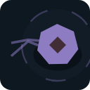 Veil Weaver (cloaks nearby enemies) |
| IV Orbital Deck |  Shield Bearer (shield recharges),  Phantom (stealthed, needs the Detector),  Jump Beetle (regularly leaps forward),  Convoy Hauler (armored, shares damage in the convoy),  Null-Field Carrier (switches off support towers) |
| V Ruined City |  Bulwark (armor),  Commander (strengthens nearby enemies),  Pressure Bunker (withstands area damage),  Decoy (towers must target it),  Shadow Colossus (armored, cloaks nearby enemies),  Pioneer (defuses traps) |
| VI Singularity |  Phase Runner (dodges every nth hit),  Berserker (unstoppable, sprints at low HP),  Warp Drone (flies, jumps ahead),  Soul Spark (flies, heals on death),  Phase Wing (switches between air and ground) |
| VII Dune Sea |  Scarab (armored and nimble),  Burrower (regularly dives; then only traps and area damage hit),  Gap Jumper (briefly jumps forward),  Rubble Swarm (withstands area damage, swarm),  Storm Falcon (flies, faster in a pack),  Tunnel Mole (digs quickly underground) |
| VIII Deep Sea |  Armor Crab (hardens the more hurt it is),  Jellyfish (flies and heals nearby enemies),  Chain Jelly (flies, shares damage), 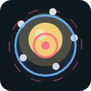 Beacon Buoy (flies, shield, towers must target it) |
| IX Storm Front |  Gust Runner (races in bursts),  Stormbird (flies, shield and nimble),  Airship (heavily armored flyer, drops Gliders),  Column Runner (faster in a cluster),  Mirror Wing (flies, deflects beams),  Insulator (interrupts Tesla chains),  Disruption Cloud (flies, nearby towers fire slower) |
| X Jungle |  Swarm Ant (less damage in a pack),  Jungle Colossus (armored, regenerates),  Martyr (heals on death),  Thornback (punishes nearby towers with cooldown) |
| XI Volcano Chain |  Ember Runner (speeds up the more HP it is missing),  Ash Wing (flies, armored, immune to slow),  Salamander and  Magma Moth (immune to burn and bleed),  Dazzler (reduces tower range) |
| XII Crystal Cave |  Crystal Warden (hardens against hits in rhythm, burn works in full),  Shard Moth (flies, splits into two Gliders),  Prism Runner (deflects beams),  Monolith (no hit above 6 % of its HP) |
| XIV Gearworks |  Cogwheel (speeds up the longer it circles),  Piston Tank (armored, takes less damage every lap) |
| XV Moon Lake |  Spray Wing (flies, takes less damage every lap), 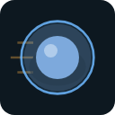 Nautilus (shield, speeds up the longer it circles) |

Ten more enemies are finished but do not appear in any mission yet. The Enemy Codex lists them under "in no mission":  Leap Spider (regularly leaps into the air),  Diver (flies, regularly dives to the ground, nimble),  Damper (makes itself and nearby enemies immune to slow, stun and pull), 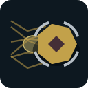 Broodmother (armored, lays Swarm Ants along the way),  Spark Worm (briefly disables nearby towers on death),  Molter (armored down to half HP, then fast), 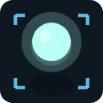 Will-o'-Wisp (flies, stealthed, evades),  Hydra (regenerates, splits into two Hydra Heads),  Hydra Head (speeds up the more HP it is missing) and 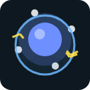 Thunder Cell (flies, shield, disables towers on death).

Stealthed enemies and carriers of a cloak field only appear in missions where the Detector can be built.

## Limits

- Fixed path, enemies cannot be redirected.
- No saved game or mission progress.
- In multiplayer, no reconnecting and no joining after the mission has started.
- The simulation is deterministic and needs no randomness. The maps use geometric markers instead of image assets.
